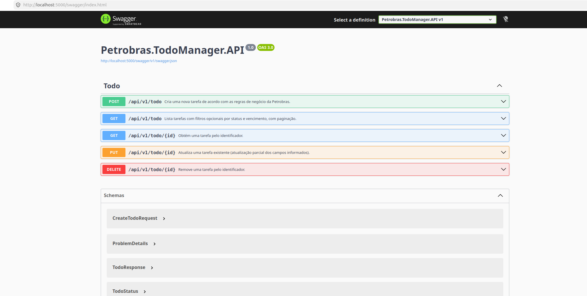

# Petrobras.TodoManager - API RESTful ToDo

API RESTful para gestão de tarefas (`ToDo`) desenvolvida em `.NET 10` com arquitetura em camadas (`API`, `BLL`, `DAL`, `Models`), integração híbrida `NHibernate + Dapper`, documentação via `Swagger/OpenAPI` e banco `Oracle XE` em `Docker`.

## Arquitetura e Stack

- **Framework:** `.NET 10 (preview)`
- **Banco:** `Oracle XE 21c` (container)
- **Persistência (escrita):** `NHibernate` + `Unit of Work`
- **Persistência (leitura):** `Dapper` para consultas filtradas
- **Padrões:** `Repository`, `Unit of Work`, `Dependency Injection`
- **Documentação da API:** `Swagger`
- **Testes unitários (bônus):** `xUnit` + `Moq`

## Diferenciais de Engenharia

- **Persistência Híbrida:** Utilização de `NHibernate` para garantir a integridade do domínio e mapeamento complexo, aliado ao `Dapper` para consultas de leitura (`Read-Only`) com performance superior e SQL otimizado para Oracle `12c+`.
- **Padrão Repository & Unit of Work:** Desacoplamento total da lógica de negócio. A transação é gerenciada de forma atômica, garantindo que operações complexas sejam revertidas integralmente em caso de falha.
- **Dialetos Oracle:** Uso de funções específicas (`TRUNC`, `OFFSET/FETCH`) e `Sequences` nativas, respeitando os padrões de DBA da Petrobras.

## Estrutura da solução

- `Petrobras.TodoManager.API`: host da Web API e configuração de DI/Swagger
- `Petrobras.TodoManager.BLL`: regras de negócio e orquestração transacional
- `Petrobras.TodoManager.DAL`: mapeamentos NHibernate, repositórios e Dapper
- `Petrobras.TodoManager.Models`: entidades, DTOs, enum e contratos
- `Petrobras.TodoManager.Tests`: testes unitários da BLL
- `database/init.sql`: schema Oracle (sequence, PK/FK, trigger e package PL/SQL)

## Endpoints

- `POST /api/v1/todo` - cria tarefa
- `GET /api/v1/todo` - lista tarefas com filtros opcionais
  - `status` (`Pendente`, `EmAndamento`, `Concluido`)
  - `vencimento` (`yyyy-MM-dd`)
- `GET /api/v1/todo/{id}` - consulta por id
- `PUT /api/v1/todo/{id}` - atualiza tarefa
- `DELETE /api/v1/todo/{id}` - remove tarefa

## Coleção Postman

- Arquivo disponível na raiz: `Petrobras.TodoManager.postman_collection.json`
- Importar no Postman via **Import** e selecionar o arquivo JSON
- Variáveis já configuradas:
  - `baseUrl` = `http://localhost:5000`
  - `todoId` = `1`
- A coleção foi revisada com base nos testes reais via `curl` (incluindo `status` numérico no `PUT`, conforme contrato da API).

### Fluxo sugerido no Postman (igual ao validado em runtime)

1. Execute `Create Todo` e copie o `id` retornado.
2. Atualize a variável `todoId` na coleção com esse valor.
3. Rode `Get Todo By Id` e `Update Todo`.
4. Rode `Delete Todo`.
5. Rode `Get Todo By Id` novamente para validar `404 Not Found`.

## Modelo de tarefa

- `Id`
- `Titulo`
- `Descricao`
- `Status` (`Pendente = 0`, `EmAndamento = 1`, `Concluido = 2`)
- `DataVencimento`

## Como executar com Docker

### Pré-requisitos

- `Docker`
- `Docker Compose`

### Subir ambiente

```bash
docker-compose up -d --build
```

Serviços:

- Oracle XE: `localhost:1521`
- API: `http://localhost:5000`
- Swagger: `http://localhost:5000/swagger`



> O primeiro startup do Oracle pode levar alguns minutos (cold start).

### Nota sobre Docker Hub (entrega do desafio)

A aplicação está totalmente containerizada e pronta para execução via `Docker Compose`.

Para este desafio, optei por **não publicar a imagem no Docker Hub** para que a avaliação inclua o processo completo de `build` multi-stage e a execução dos testes unitários durante a montagem da imagem, garantindo a integridade do código entregue.

## Decisões de Arquitetura e Trade-offs

Esta solução foi desenhada para equilibrar resiliência, performance e manutenibilidade em um contexto corporativo com Oracle.

### 1) Persistência híbrida: NHibernate + Dapper

- **NHibernate (CUD):** usado em operações de escrita para preservar integridade de domínio, estado de entidade e consistência transacional.
- **Dapper (Read):** usado em leitura filtrada/paginada para SQL otimizado no Oracle (`TRUNC`, `OFFSET/FETCH`).
- **Trade-off:** maior complexidade de manutenção por coexistência de duas abordagens de acesso a dados.
- **Ganho:** melhor relação entre robustez de escrita e performance de consulta.

### 2) .NET 10 + Docker multi-stage

- **Escolha:** stack moderna e multiplataforma, alinhada ao ambiente Linux e execução containerizada.
- **Trade-off:** versões recentes/preview exigem atenção adicional com estabilidade e compatibilidade de pacotes.
- **Ganho:** portabilidade, imagens finais menores e pipeline de build mais limpo com separação entre build/runtime.

### 3) Validação por camadas: Data Annotations + BLL

- **API:** valida contrato de entrada (campos obrigatórios, tamanhos e paginação) para falha rápida (`fail-fast`).
- **BLL:** valida regras de domínio (ex.: vencimento retroativo e transições inválidas de status).
- **Trade-off:** validações complementares em pontos distintos da aplicação.
- **Ganho:** proteção do domínio mesmo quando consumido por diferentes entradas além da API.

### 4) Tratamento global de erros com ProblemDetails (RFC 7807)

- **Escolha:** padronização de erros com `ProblemDetails` e `traceId` para rastreabilidade.
- **Trade-off:** necessidade de disciplina na padronização de exceções de negócio/técnicas.
- **Ganho:** contrato de erro interoperável com clientes modernos e integrações corporativas.

## Segurança e Autenticação

Para este desafio, a autenticação via `JWT (JSON Web Token)` não foi implementada por decisão consciente de escopo:

1. **Foco arquitetural:** prioridade na demonstração de `Repository`, `Unit of Work`, regras de domínio em `BLL` e persistência híbrida (`NHibernate + Dapper`).
2. **Experiência de avaliação:** endpoints acessíveis diretamente via `Swagger`/`Postman`, sem overhead de emissão/renovação de token no contexto do teste técnico.
3. **Contexto corporativo:** em ambiente real, a autenticação/autorização pode ser delegada a `API Gateway`/`IdP` (ex.: `OAuth2`/`OpenID Connect`, integração com diretório corporativo).

A API foi estruturada para evolução sem impacto no domínio: em uma próxima etapa, basta adicionar middleware de autenticação, políticas de autorização e uso de `[Authorize]` nos endpoints protegidos.

## Como executar localmente (sem Docker)

```bash
dotnet restore Petrobras.TodoManager.sln
dotnet run --project Petrobras.TodoManager.API/Petrobras.TodoManager.API.csproj
```

Configure a connection string `OracleDb` em `Petrobras.TodoManager.API/appsettings.json`.

## Banco de dados (padrão corporativo Oracle)

O script `database/init.sql` implementa:

- Nomenclatura corporativa (`TB_`, `CD_`, `DS_`, `DT_`, `ST_`)
- `SEQUENCE` para geração de chave primária
- `PK` e `FK` (`TB_PETRO_TODO` -> `TB_PETRO_AREA`)
- `TRIGGER` de auditoria (`DT_ALTERACAO`)
- `PACKAGE` PL/SQL (`PKG_TODO_RULES`) para rotina de limpeza

## Testes

```bash
dotnet test Petrobras.TodoManager.Tests/Petrobras.TodoManager.Tests.csproj
```

### Estratégia de Testes

- Implementei uma suíte de testes unitários utilizando `xUnit` e `Moq`, com foco na camada de `BLL`.
- **Mocks de Infraestrutura:** a lógica de negócio foi isolada das dependências de banco (`NHibernate`/`Dapper`) por meio de contratos (`ITodoRepository` e `IUnitOfWork`).
- **Verificação Transacional:** os cenários de escrita validam o fluxo do `UnitOfWork` (`Begin -> Commit`) e também o `Rollback` em falhas inesperadas.
- **Cobertura de Código:** `Coverlet` configurado para geração de relatórios, cobrindo as regras críticas de negócio aplicadas no desafio.

Coberturas implementadas na BLL:

- validação de vencimento retroativo
- commit transacional em criação válida
- rollback em falha de atualização

## Casos de teste executados (API em Docker + `curl`)

Casos manuais executados contra `http://localhost:5000` com a API e Oracle XE em execução via `docker-compose`:

| Caso | Requisição | Resultado esperado | Resultado observado |
|---|---|---|---|
| Criar tarefa | `POST /api/v1/todo` | `201 Created` + payload da tarefa | `201 Created` ✅ |
| Listar tarefas paginadas | `GET /api/v1/todo?page=1&pageSize=10` | `200 OK` + lista | `200 OK` ✅ |
| Buscar por id existente | `GET /api/v1/todo/{id}` | `200 OK` | `200 OK` ✅ |
| Atualizar tarefa | `PUT /api/v1/todo/{id}` com `status=1` | `200 OK` + tarefa atualizada | `200 OK` ✅ |
| Excluir tarefa | `DELETE /api/v1/todo/{id}` | `204 No Content` | `204 No Content` ✅ |
| Buscar após exclusão | `GET /api/v1/todo/{id}` | `404 Not Found` (`ProblemDetails`) | `404 Not Found` ✅ |

Exemplo de payload usado no `PUT` validado:

```json
{
  "status": 1,
  "descricao": "Atualizado por teste curl"
}
```

## Considerações do autor

Embora o enunciado permita `.NET Framework`, a implementação foi realizada em `.NET 10` por portabilidade e execução multiplataforma (ambiente Linux + Docker). A arquitetura (`DAL/BLL`, `Repository`, `Unit of Work`) foi mantida com enfoque em cenários corporativos e legado Oracle.

Em um contexto `.NET Framework 4.6/4.8`, o desenho arquitetural seria mantido, com adaptação da injeção de dependência para containers externos (ex.: `Autofac`), preservando os princípios `SOLID` e baixo acoplamento.
